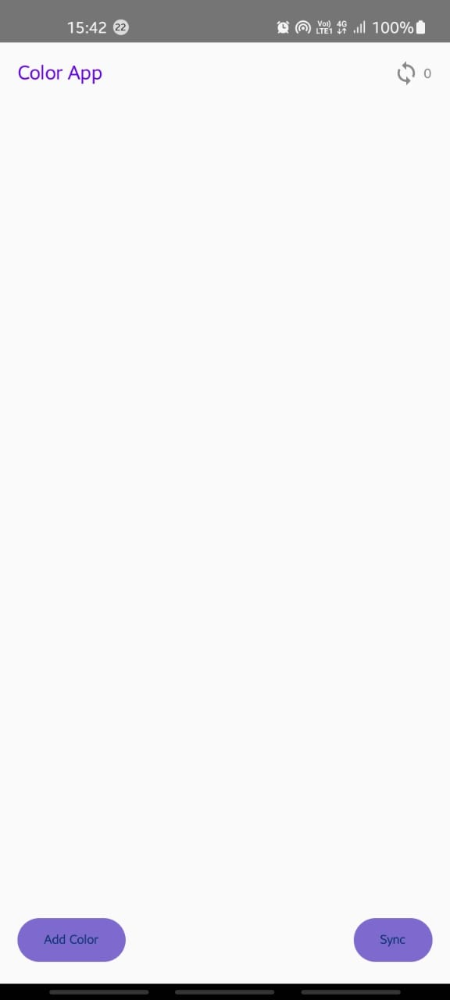
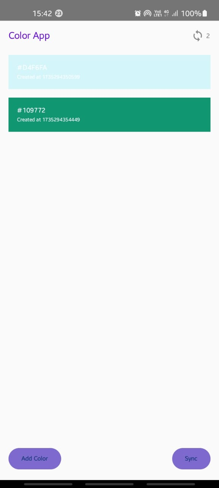
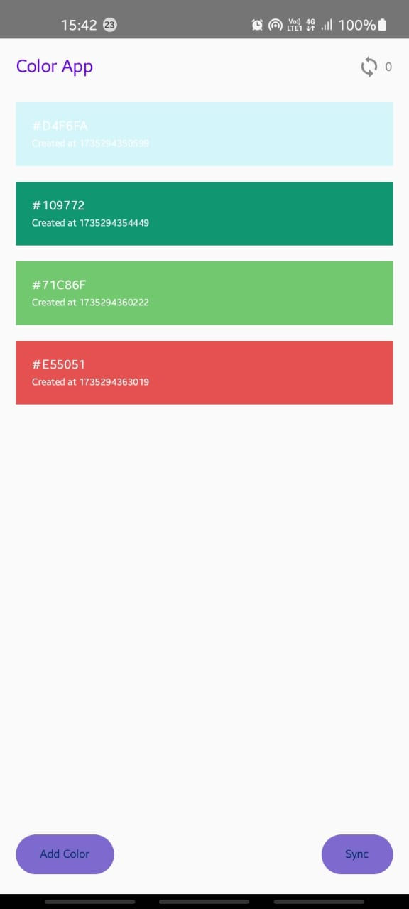
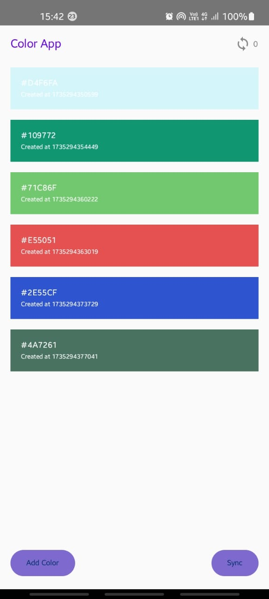

# **Color App**
## **Overview**
Color App is a Jetpack Compose-based Android application that allows users to view, add, and sync colors. Each color is displayed with a unique code and creation timestamp. The app supports offline mode and follows the MVVM architecture pattern with Room Database for local storage and Firebase/Google Sheets for syncing data.</br>
## Features
**1. Color List Display**
- Displays a list of colors with their unique hex codes and creation timestamps.
- Supports offline viewing using Room Database.

**2. Add Color**
- Adds a new random color to the list in the format.
  ```
  { color : "#AABBFF" , time : 1683798291864 }
  ```
- Automatically saves the color to the local Room Database.

**3. Sync Colors**
- Syncs unsynced colors from the local database to the cloud database (Firebase or Google Sheets).
- Displays the count of pending sync entries next to the Sync button.

**4. Offline Support**
- Colors are stored locally and displayed even when there is no internet connectivity.

**5. Responsive Design**
- The UI is designed using Jetpack Compose for a modern and responsive look.

## Tech Stack
- **Programming Language:** Kotlin
- **UI Framework:** Jetpack Compose
- **Architecture Pattern:** MVVM (Model-View-ViewModel)
- **Local Database:** Room Database
- **Cloud Database:** Firebase Database or Google Sheets

## How It Works

**1. Architecture Overview**
The app follows the MVVM architecture pattern to separate concerns:
- **Model:** Manages data operations, including local and cloud storage.
- **ViewModel:** Acts as a bridge between the UI and the Model, exposing data through StateFlow for real-time UI updates.
- **View:** Composable UI components that dynamically render based on the state.

**2. Data Flow**
- **Adding a Color:**
  - Generates a random hex color and timestamp.
  - Saves the data locally in Room Database.
  - Updates the UI with the new color.

- **Syncing Colors:**
  - Sends unsynced entries from the local database to the cloud.
  - Updates the sync count in real time.

**3. Offline Support**
- The app uses Room Database to store color entries locally, enabling offline access to the color list.

## **Screenshots**
### **Home Screen**


### **Adding Colors**



### **Syncing Colors**



